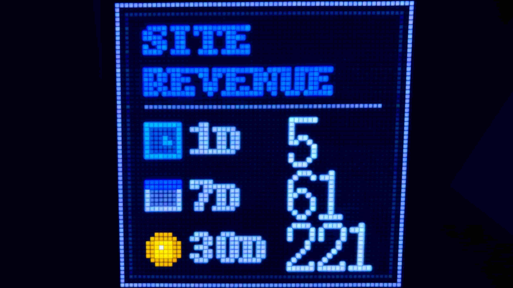

# Pixoo AdSense Display

Display your Google AdSense earnings on a Pixoo 64 display using Python.



---

## Architecture

```
        [ Cloud ]
+---------------------+
|   Google AdSense    |
+----------+----------+

        [ Local Network ]
           |
+----------v----------+
|   Raspberry Pi      |
+----------+----------+
           |
+----------v----------+
|      Pixoo 64       |
+---------------------+
```

---

## Features

- Fetch AdSense earnings (Today / 7 Days / 30 Days)
- Custom pixel-style UI rendering
- Pixoo local HTTP API integration
- Designed for Raspberry Pi + systemd

---

## Requirements

- Python 3.9+
- Pixoo 64
- Google AdSense account
- Google Cloud OAuth credentials

---

## Setup

### 1. Install dependencies

```bash
pip install -r requirements.txt
```

### 2. Add OAuth credentials

Place your OAuth file in the project root:

```
client_secret.json
```

On first run, a file named:

```
token.json
```

will be generated.

⚠️ Do NOT commit these files.

### 3. Configure Pixoo IP

Edit:

```python
PIXOO_IP = "192.168.x.x"
```

### 4. Run

```bash
python adsense_report.py
```

---

## Notes

Pixoo requires sending `SendHttpGif` before `SendHttpText`.

A short delay is inserted after `SendHttpGif` to prevent flickering or disappearing text.

---

## License

MIT
